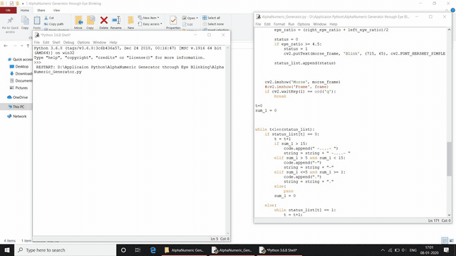

# Blinker

## Description
This program facilitates user to generate Alphanumeric character by Blinking Eye at certain frequency. The eyes are detected by detecting all 68 facial landmarks and detecting the frequency of blinking. These blinking are translated to Morse Code where short blinks are "dot" and and long blinks are "dash". These Morse Code is further converted to Alphanumeric character.

### Prerequisites
The Program is written Python 3.6.8 in order to support dlib library.
Several external packages have been included in the program.
1. OpenCV
2. Numpy
3. dlib
You can install these packages by following command.
```
$ pip install opencv-python
$ pip install numpy
$ pip install dlib-19.8.1-cp36-cp36m-win_amd64.whl
```
dlib version must be installed as per Python version and configuration.
To check Python Version
```
$ python --version
```
Check this [URL](https://pypi.org/simple/dlib/) for dlib version.

### Demo
Here im typing "Hi" by blinking my Eyes.


### References
Check this [Geeks for Geeks](https://www.geeksforgeeks.org/morse-code-translator-python/ target="_blank") website to understand better working of Morse Code translator.


